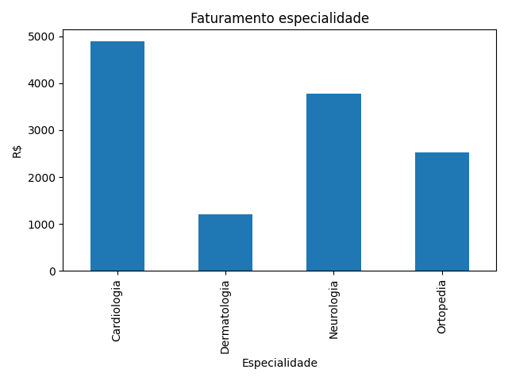
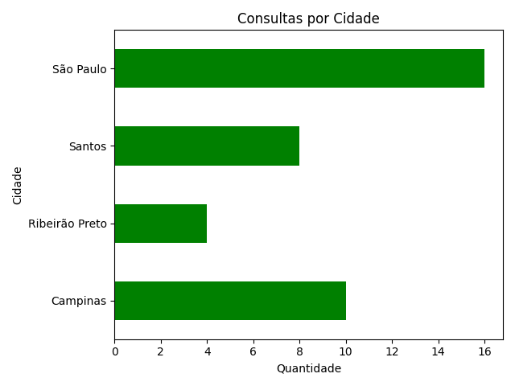
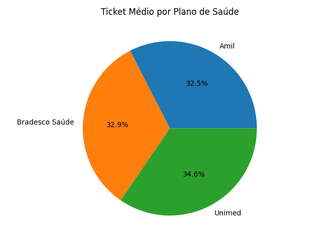

# 🏥 Clínica SQL + Python — Projeto de Portfólio

Projeto desenvolvido para praticar **SQL** e **Python** com um banco de dados fictício de uma clínica médica.  
O banco conta com 3 tabelas relacionadas entre si, cobrindo desde consultas básicas até JOINs, subqueries, limpeza de dados e visualizações.

---

## 🗄️ Estrutura do Banco de Dados

```
pacientes        consultas        medicos
─────────        ─────────        ───────
id_paciente ──→  id_paciente      id_medico
nome             id_medico   ──→  nome
idade            id_consulta      especialidade
genero           data_consulta    crm
cidade           valor_consulta   cidade
plano_saude      retorno
```

---

## 📁 Estrutura do Projeto

```
clinica-sql/
│
├── dados/
│   ├── pacientes.csv
│   ├── medicos.csv
│   └── consultas.csv
│
├── queries/
│   ├── 01_basico.sql
│   ├── 02_agregacao.sql
│   ├── 03_joins.sql
│   └── 04_avancado.sql
│
├── python/
│   ├── conexao.py
│   ├── limpeza.py
│   ├── analise.py
│   ├── graficos.py
│   ├── faturamento_especialidade.png
│   ├── consultas_cidade.png
│   └── ticket_plano.png
│
├── clinica.db
└── README.md
```

---

## 🗃️ SQL — Conceitos Praticados

| Arquivo | Conceitos |
|---|---|
| `01_basico.sql` | SELECT, FROM, WHERE, ORDER BY, LIMIT |
| `02_agregacao.sql` | COUNT, SUM, AVG, GROUP BY, HAVING |
| `03_joins.sql` | INNER JOIN, múltiplos JOINs, alias (AS) |
| `04_avancado.sql` | LEFT JOIN, IS NULL, Subqueries |

### Exemplos de Queries

**Faturamento total por médico:**
```sql
SELECT medicos.nome, SUM(valor_consulta) AS total_faturado
FROM medicos
JOIN consultas ON consultas.id_medico = medicos.id_medico
GROUP BY medicos.nome
ORDER BY total_faturado DESC
```

**Pacientes que nunca consultaram:**
```sql
SELECT pacientes.nome
FROM pacientes
LEFT JOIN consultas ON pacientes.id_paciente = consultas.id_paciente
WHERE consultas.id_paciente IS NULL
```

**Consultas acima da média:**
```sql
SELECT pacientes.nome, consultas.valor_consulta
FROM consultas
JOIN pacientes ON consultas.id_paciente = pacientes.id_paciente
WHERE valor_consulta > (SELECT AVG(valor_consulta) FROM consultas)
```

---

## 🐍 Python — Conceitos Praticados

| Arquivo | O que faz |
|---|---|
| `conexao.py` | Conecta ao banco SQLite com `sqlite3` e carrega tabelas com `pandas` |
| `limpeza.py` | Trata valores nulos com `fillna`, converte tipos com `pd.to_numeric` e `astype` |
| `analise.py` | Une as 3 tabelas com `merge` e extrai insights com `groupby` |
| `graficos.py` | Gera e salva visualizações com `matplotlib` |

### Insights extraídos

- 📊 Faturamento total por especialidade médica
- 🏙️ Volume de consultas por cidade
- 💳 Ticket médio por plano de saúde

### Visualizações geradas

**Faturamento por Especialidade**  


**Consultas por Cidade**  


**Ticket Médio por Plano**  


---

## 🛠️ Como Executar

### SQL
1. Baixe o [DB Browser for SQLite](https://sqlitebrowser.org) gratuitamente
2. Abra o arquivo `clinica.db` ou importe os CSVs da pasta `dados/`
3. Execute as queries da pasta `queries/` na aba **Execute SQL**

### Python
1. Clone o repositório e acesse a pasta `python/`
2. Instale as dependências:
```bash
pip install pandas matplotlib
```
3. Execute os arquivos em ordem:
```bash
python conexao.py
python limpeza.py
python analise.py
python graficos.py
```

---

## 📈 Próximos Passos

- [ ] Levar as análises para o Power BI
- [ ] Adicionar mais insights com `seaborn`

---

## 👤 Autor

**Matheus Zucchermario**  
[](https://www.linkedin.com/in/matheus-zucchermario-633916375/)
